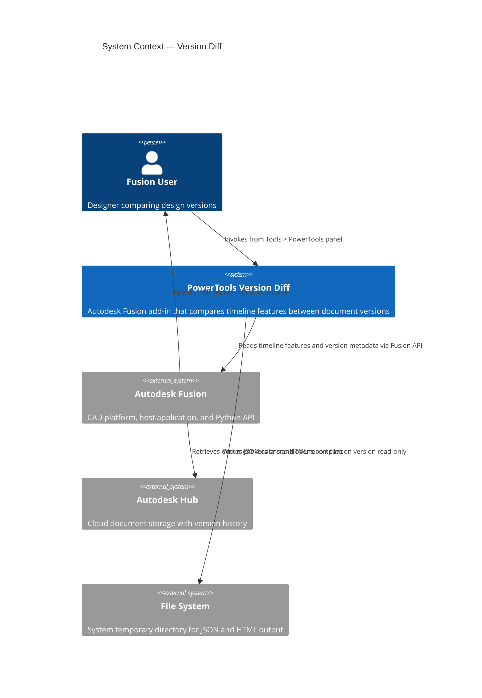
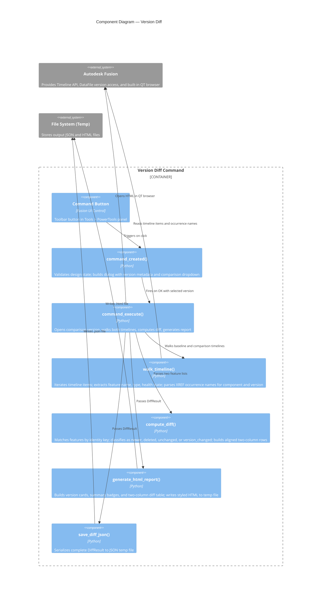
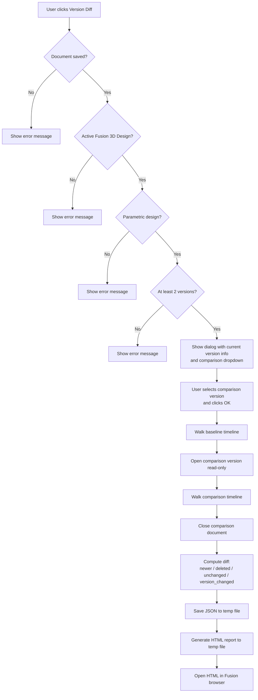
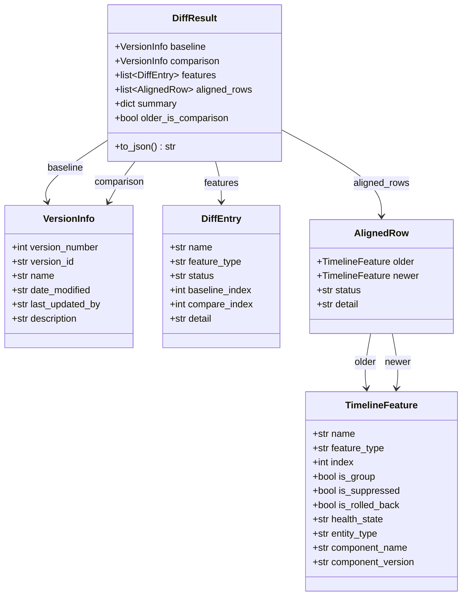

# Version Diff

[Back to README](../README.md)

## Overview

The **Version Diff** command compares the timeline of the active Autodesk Fusion design against any other saved version of the same document. It produces an interactive two-column HTML report that shows every timeline feature side by side, highlighting features that were added, deleted, or modified between the two versions.

The command is particularly useful for reviewing design changes before promoting a version, auditing what changed after a colleague saved a new version, or tracking external reference (XREF) component version updates across an assembly's history.

> **Note:** This command is available only for parametric (timeline-based) designs that have at least two saved versions. It is not available for designs in Direct Design mode or for unsaved documents.

## Prerequisites

- A design document must be open in Autodesk Fusion.
- The active product must be an Autodesk Fusion 3D Design.
- The design must use the parametric timeline. Designs in Direct Design mode are not supported.
- The document must be saved to an Autodesk Hub.
- At least two saved versions must exist.

## Access

The **Version Diff** command is located on the **Tools** tab, in the **PowerTools** panel of the Autodesk Fusion Design workspace.

1. Open a parametric design document in Autodesk Fusion.
2. On the **Tools** tab, in the **PowerTools** panel, select **Version Diff**.

## How to use

1. Open the design you want to analyze.
2. Run **Version Diff** from the **PowerTools** panel.
3. The command dialog opens and displays the current version metadata:
   - Version number
   - Date modified
   - Last updated by
   - Description
4. Select a comparison version from the **Compare With Version** dropdown. Versions are listed newest first, showing the version number, date, and user.
5. Click **OK** to start the comparison.
6. The add-in opens the selected comparison version (read-only), walks both timelines, computes the diff, and closes the comparison document.
7. The HTML report opens automatically in the Fusion built-in browser.

## Understanding the report

### Version cards

The report header shows two version cards side by side:

| Card | Position | Description |
|---|---|---|
| **Older version** | Left | The earlier of the two compared versions, showing version number, date, user, and description. |
| **Newer version** | Right | The later of the two compared versions, with the same metadata fields. |

### Summary badges

Below the version cards, a row of summary badges shows the count of changes:

| Badge | Color | Description |
|---|---|---|
| **Newer** | Green | Features present in the newer version but not in the older version. |
| **Deleted** | Red | Features present in the older version but not in the newer version. |
| **XREF Updated** | Yellow | XREF (occurrence) features where the referenced component version changed. Only shown when at least one XREF version change is detected. |
| **Unchanged** | Gray | Features present in both versions with no changes. |

### Diff table

The main body of the report is a two-column aligned table:

| Column group | Description |
|---|---|
| **Older version (left)** | Timeline index, feature name, and feature type from the older version. |
| **Status (center)** | Badge indicating the change status: **NEW**, **DEL**, **SAME**, or **VER &Delta;**. |
| **Newer version (right)** | Timeline index, feature name, and feature type from the newer version. |

Rows are color-coded by status:

| Status | Row highlight | Description |
|---|---|---|
| **NEW** | Right side highlighted green | Feature exists only in the newer version. |
| **DEL** | Left side highlighted red | Feature exists only in the older version. |
| **SAME** | No highlight | Feature is unchanged between versions. |
| **VER &Delta;** | Entire row highlighted yellow | XREF component version changed (detail shows the version transition, for example `v1 → v2`). |

### XREF version tracking

When the add-in encounters an Occurrence (external reference) feature, it parses the component name and version from the timeline entry. Two occurrences referencing the same component are matched even if their versions differ. The report shows the component version below the feature name and, for version changes, displays the transition (for example `v1 → v2`) in the status column.

## Output files

The command writes two files to the system's temporary directory:

| File | Format | Description |
|---|---|---|
| `version_diff_<id>.json` | JSON | Complete diff result including version metadata, feature lists, aligned rows, and summary statistics. |
| `version_diff_<id>.html` | HTML | Formatted two-column diff report displayed in the Fusion built-in browser. |

Both files use random identifiers. The temporary directory is `%TEMP%` on Windows and `/tmp` on macOS.

## Limitations

- Not available for designs in Direct Design mode.
- The comparison version is opened read-only. If the comparison version cannot be opened (for example, due to a corrupted version), the command will report an error.
- Timeline groups are skipped. Only individual features within groups are compared.
- Feature matching uses the feature name and type as the identity key. If a feature was renamed between versions, it will appear as a deletion and a new addition rather than a modification.
- The report is a static snapshot. It does not update automatically when the model changes.

---

## Architecture

### System context

The following diagram shows the relationship between the user, the Version Diff command, Autodesk Fusion, and the file system.

### Component diagram

The following diagram shows how the internal components of the command interact during execution.

### Command execution flow

The following diagram shows the step-by-step execution flow when the user runs the Version Diff command.

### Data model

The following diagram shows the relationships between the data structures used in the diff pipeline.

---

[Back to README](../README.md)

---

*Copyright © 2026 IMA LLC. All rights reserved.*
