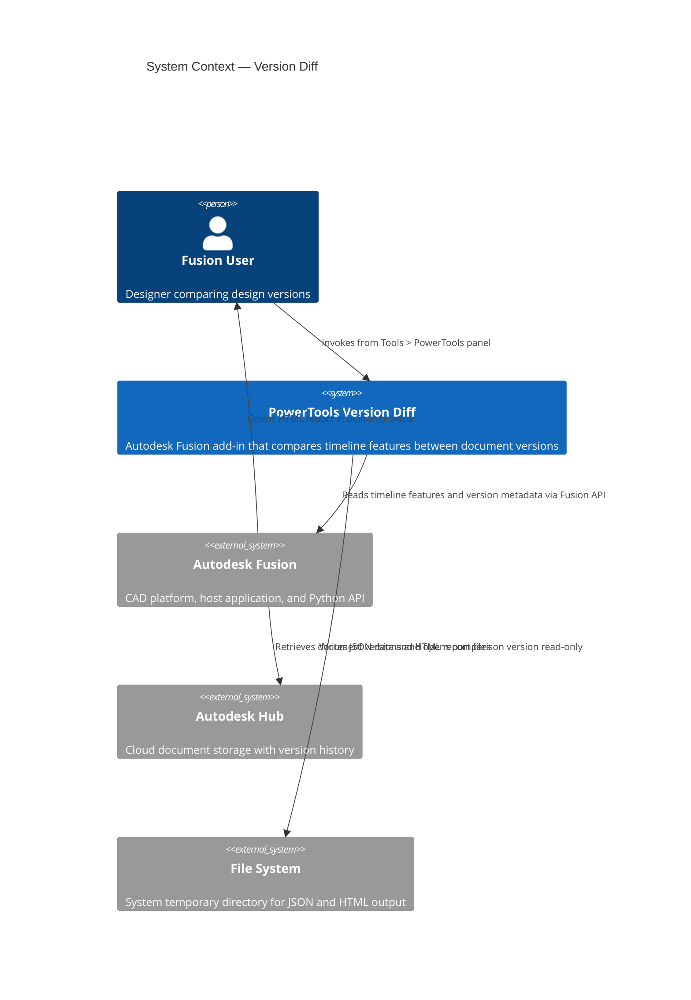
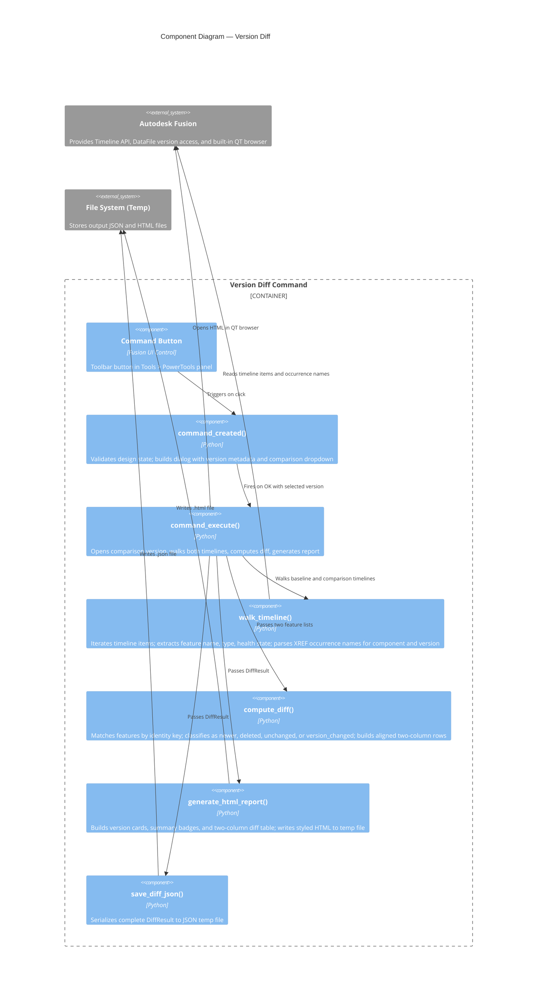
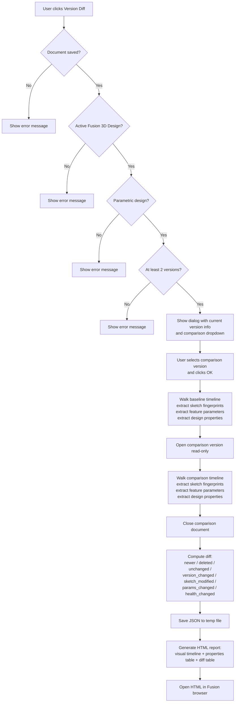
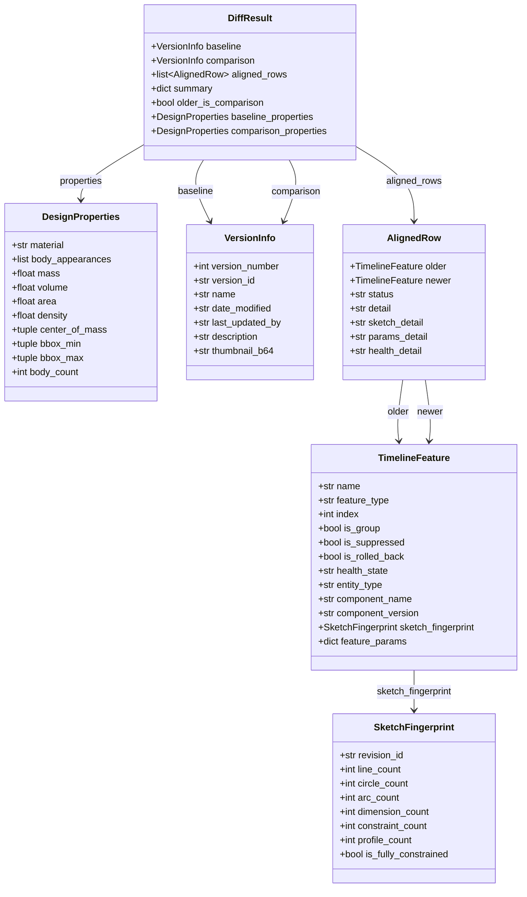

# Version Diff

[Back to README](../README.md)

## Overview

The **Version Diff** command compares the active Autodesk Fusion design against any other saved version of the same document. It produces an interactive HTML report with a visual timeline overview, design property comparison, and a detailed two-column diff table showing every timeline feature side by side.

The command detects new features, deleted features, XREF component version changes, sketch modifications, parameter value changes, and feature health state changes. It is useful for reviewing design changes before promoting a version, auditing what changed after a colleague saved a new version, or tracking changes across an assembly's history.

> **Note:** This command is available only for parametric (timeline-based) designs that have at least two saved versions. It is not available for designs in Direct Design mode or for unsaved documents.

## Prerequisites

- A design document must be open in Autodesk Fusion.
- The active product must be an Autodesk Fusion 3D Design.
- The design must use the parametric timeline. Designs in Direct Design mode are not supported.
- The document must be saved to an Autodesk Hub.
- At least two saved versions must exist.

## Access

The **Version Diff** command is located on the **Tools** tab, in the **PowerTools** panel of the Autodesk Fusion Design workspace.

1. Open a parametric design document in Autodesk Fusion.
2. On the **Tools** tab, in the **PowerTools** panel, select **Version Diff**.

## How to use

1. Open the design you want to analyze.
2. Run **Version Diff** from the **PowerTools** panel.
3. The command dialog opens and displays:
   - **Current Version** — version number, date modified, saved by, and description.
   - **Version Summary** (expandable) — total versions, creation date, last saved date, contributors, milestones, revisions, and public share link status.
   - **Compare With Version** dropdown — all other versions listed newest first with date and user.
4. Select a comparison version from the dropdown.
5. Click **OK** to start the comparison.
6. The add-in opens the selected comparison version (read-only), walks both timelines, computes the diff, and closes the comparison document.
7. The HTML report opens automatically in the Fusion built-in browser.

## Understanding the report

### Version cards

The report header shows two version cards side by side with thumbnails (when available), version number, date, user, and description.

### Visual timeline

Below the version cards, a compact SVG visualization shows both timelines as horizontal rows of feature boxes with colored connection ribbons between them. Each box displays the feature-type icon (extrude, fillet, sketch, joint, etc.) and is color-coded by change status. Ribbons connect matched features; fan-out shapes indicate insertions; fan-in shapes indicate deletions. The visualization scrolls horizontally for large designs.

### Design properties table

A three-column comparison table showing design-level properties side by side:

| Property | Description |
|---|---|
| Material | Physical material assigned to the root component. |
| Appearances | Unique body appearance names. |
| Bodies | Body count. |
| Mass, Volume, Area, Density | Physical properties from the root component. |
| Center of Mass | X, Y, Z coordinates. |
| Extents | Bounding box dimensions (W &times; H &times; D). |

Changed values are highlighted in the newer column. The heading includes a summary of which properties changed.

### Summary badges

A row of interactive filter badges shows the count of changes by status. Click a badge to show or hide those rows in the diff table.

| Badge | Color | Description |
|---|---|---|
| **Newer** | Green | Features present only in the newer version. |
| **Deleted** | Red | Features present only in the older version. |
| **XREF Updated** | Yellow | XREF features where the referenced component version changed. |
| **Sketch Modified** | Amber | Sketches whose content changed (detected via `revisionId`). |
| **Params Changed** | Blue | Features whose parameter values changed. |
| **Health Changed** | Orange | Features whose only change is their health state (e.g., Healthy to Warning or Error). |
| **Unchanged** | Gray | Features identical in both versions. |

### Diff table

The main body of the report is a two-column aligned table with feature-type icons before each feature name. The heading includes a summary of changes by feature type.

| Column group | Description |
|---|---|
| **Older version (left)** | Timeline index, feature icon and name, and feature type. |
| **Status (center)** | Badge: **NEW**, **DEL**, **SAME**, **VER &Delta;**, **SK &Delta;**, **PRM &Delta;**, or **HTH &Delta;**. |
| **Newer version (right)** | Timeline index, feature icon and name, and feature type. |

Rows are color-coded by status and only the changed side is highlighted:

| Status | Highlight | Description |
|---|---|---|
| **NEW** | Newer side green | Feature exists only in the newer version. |
| **DEL** | Older side red | Feature exists only in the older version. |
| **SAME** | No highlight | Feature is unchanged between versions. |
| **VER &Delta;** | Newer side yellow | XREF component version changed (detail below name shows `v1 → v2`). |
| **SK &Delta;** | Newer side amber | Sketch modified (detail below name shows element count deltas). |
| **PRM &Delta;** | Newer side blue | Parameter values changed (detail below name shows `d1: 10 mm → 15 mm`). |
| **HTH &Delta;** | Newer side orange | Feature health state changed with no other modifications (detail below name shows `Healthy → Error`). |

### Change detection details

**XREF version tracking:** Occurrence features are matched by component name across versions. Version changes display the transition below the feature name.

**Sketch modification:** Detected via the Fusion `Sketch.revisionId` property, which changes any time sketch content is modified. Element count deltas (lines, circles, arcs, dimensions, constraints, profiles) are shown when counts differ.

**Parameter changes:** All model parameters are extracted per feature via `parameter.createdBy` linkage. Numeric values are compared with tolerance to avoid false positives from expression formatting differences. Only parameters with actual value changes are reported.

**Health state changes:** Detected via the Fusion `FeatureHealthStates` enum, which reports each feature as Healthy, Warning, or Error. A feature is flagged as health-changed only when its health state differs between versions and no other modification (parameters, sketch content, XREF version) is detected. The transition is shown below the feature name (e.g., `Healthy → Error`).

## Output files

The command writes two files to the system's temporary directory:

| File | Format | Description |
|---|---|---|
| `version_diff_<id>.json` | JSON | Complete diff result including version metadata, feature lists, aligned rows, and summary statistics. |
| `version_diff_<id>.html` | HTML | Formatted two-column diff report displayed in the Fusion built-in browser. |

Both files use random identifiers. The temporary directory is `%TEMP%` on Windows and `/tmp` on macOS.

## Limitations

- Not available for designs in Direct Design mode.
- The comparison version is opened read-only. If the comparison version cannot be opened (for example, due to a corrupted version), the command will report an error.
- Timeline groups are skipped. Only individual features within groups are compared.
- Feature matching uses the feature name and type as the identity key. If a feature was renamed between versions, it will appear as a deletion and a new addition rather than a modification.
- Sketch modification detection uses `revisionId`, which is only available on Sketch features. Other feature types do not expose a revision identifier.
- Parameter change detection compares numeric values with tolerance. Expression formatting differences (such as `180.00 deg` vs `180 deg`) do not trigger false positives.
- The report is a static snapshot. It does not update automatically when the model changes.

---

## Architecture

### System context

The following diagram shows the relationship between the user, the Version Diff command, Autodesk Fusion, and the file system.

### Component diagram

The following diagram shows how the internal components of the command interact during execution.

### Command execution flow

The following diagram shows the step-by-step execution flow when the user runs the Version Diff command.

### Data model

The following diagram shows the relationships between the data structures used in the diff pipeline.

---

[Back to README](../README.md)

---

*Copyright © 2026 IMA LLC. All rights reserved.*
